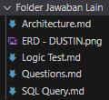

# PT Bionic Front End Developer Test

This project created using:

- React (Vite)
- TailwindCSS + DaisyUI
- Axios
- React Router
- React Query

\*note: For the other answers are available at folder `"Folder Jawaban Lain"`
\*note: User commited the repository is bugged because of git-scm, there's still no clue how to fix it.



## Guidance

### How to run:

We can run it both using `npm` or `yarn`.

---

For installation using `npm`, you can run it by typing these command:

```bash
npm install
```

or if you're using `yarn`:

```bash
yarn
```

---

To run Vite, you can run it using `npm` by typing these command:

```bash
npm run dev
```

or if you're using `yarn`:

```bash
yarn dev
```

---

## Routes

For routes that available, you can read the information below.

### Responsive Layout (only on 768p screen and mobile screen)

> Enpoint `'/'`


### API Test

> Endpoint `'/api'`


### API Detail Test

> Endpoint `'/api/{id}'`


## API

Api that used is `https://api.npoint.io/093ff301f5018932169c`

\*note: This API value is a result of `https://bti.id/services/btiportalcorems/api/pt-job-posts/no-auth` GET API
